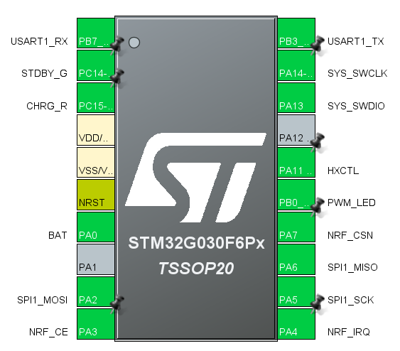

1.电池adc

```
BAT PA0
```


2.nrf spi

```
MOSI 	PA2
NRF_CE	PA3
NRF_IRQ	PA4
SPI_SCK	PA5
MISO	PA6
NRF_CSN	PA7
```


3.pwm led

```
PWM		PB0
HXCTL	PA11
```


4.调试串口

```
RX	PB7
TX	PB3
```


5.DEBUG

```
SWCLK	PA14
SWDIO	PA13
```


6.电源管理

```
STDBY_G		PB9/PC14	//充满
CHRG_R		PC15		//充电
```


